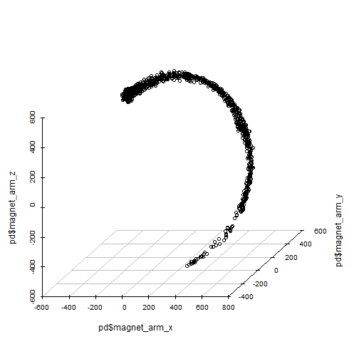

<style>
.small-code pre code {
  font-size: 1em;
}
.reveal h1, .reveal h2, .reveal h3 {
  word-wrap: normal;
  -moz-hyphens: none;
}
</style>

Precision Coaching Concept Application
========================================================
author: jrfoster
date: 18 February, 2017
autosize: true
transition: rotate


Background & Motivation
========================================================

<b>Precision Medicine</b> proposes that medical decisions, practices, and/or products be tailored to the individual patient
  - Aims to reduce one-size-fits-all approaches to treatment
  - Techniques include molecular diagnostics, imaging, and analytics/software

<b>Qualitative Activity Recognition</b> builds on the notion that optimal impact of exercise is achieved via correct technique
  - Aims to provide feedback to the indiviual on the quality of the exercise being performed
  - Rooted in Biomechanics; replaces video for evaluation of technique

Precision Coaching Application
========================================================
- Could combine these two ideas to help physical therapists evaluate and monitor therepeutic exercises and their and outcomes
- Uses data from <a href="https://eduardovelloso.files.wordpress.com/2011/06/main.pdf">Velloso's Qualitative Activity Recognition</a> study
- Allows user to visualize sensor output at various body locations for test subjects performing a dumbbell curl
  - Compare correct and incorrect technique
  - Visualize in 3-D various sensor output
  - Visualize and compare test subjects' range of motion

Sample Study Data Visualization
========================================================
class: small-code


```r
pmlRaw <- readRDS(
  "./PrecisionCoaching/pmlTraining.rds")

assertPackage("dplyr")
pd <- pmlRaw %>%
  select(magnet_arm_x, 
         magnet_arm_y, 
         magnet_arm_z, 
         user_name, 
         classe) %>%
  filter(user_name == "jeremy" 
         & classe %in% c("A","C"))

assertPackage("scatterplot3d")
scatterplot3d(x=pd$magnet_arm_x, 
              y=pd$magnet_arm_y, 
              z=pd$magnet_arm_z, 
              box=FALSE)
```
***


Application Screen Shot
========================================================
The screen shot below shows the same visualization in the Precision Coaching Concept Application


Conclusion
========================================================

Clearly, an application like this could benefit both Physical Therapists and patients
- Visual evaluation of improvement in range of motion
- Real-time feedback to the patient about technique
- Better physical records of baseline movement and longitudal tracking of individual

Some useful, related links
- <a href="https://github.com/jrfoster/ddpProject" target="_blank">GitHub</a> repo containing code for this presentation and the application itself
- <a href="https://jrfoster.shinyapps.io/PrecisionCoaching/" target="_blank">ShinyApps.io</a> deployment of the application
