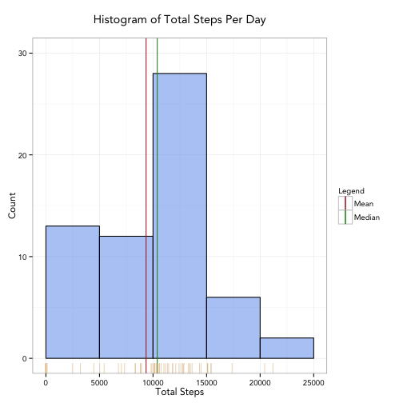
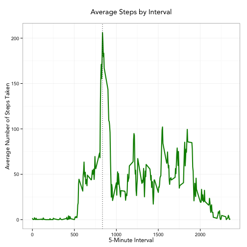
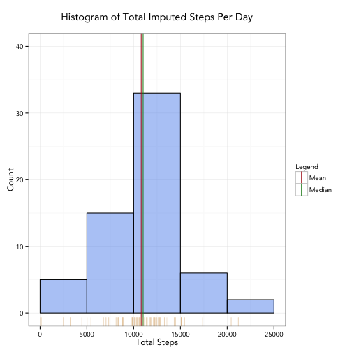
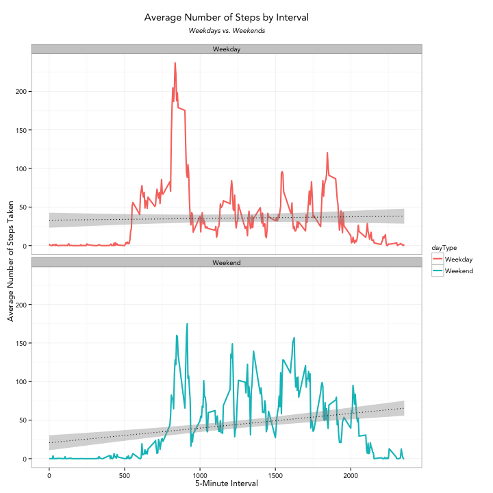

# Introduction


It is now possible to collect a large amount of data about personal movement using activity monitoring devices such as a Fitbit, Nike Fuelband, or Jawbone Up. These type of devices are part of the “quantified self” movement – a group of enthusiasts who take measurements about themselves regularly to improve their health, to find patterns in their behavior, or because they are tech geeks. But these data remain under-utilized both because the raw data are hard to obtain and there is a lack of statistical methods and software for processing and interpreting the data. 

# About the Data

This assignment makes use of data from a personal activity monitoring device. This device collects data at 5 minute intervals through out the day. The data consists of two months of data from an anonymous individual collected during the months of October and November, 2012 and include the number of steps taken in 5 minute intervals each day.

The variables included in this dataset are:

 - **steps**: Number of steps taking in a 5-minute interval (missing values are coded as NA)
 - **date**: The date on which the measurement was taken in YYYY-MM-DD format
 - **interval**: Identifier for the 5-minute interval in which measurement was taken

The dataset is stored in a comma-separated-value (CSV) file and there are a total of 17,568 observations in this dataset.

# Analysis

This section contains information and figures to address the requirements of the assignment.

## Preparing the R Environment

To perform the analysis and create the plots, we are using the `dplyr` and `ggplot2` libraries, so we must first load them into the environment.


```r
suppressMessages(library(dplyr))
suppressMessages(library(ggplot2))
```

## Loading and preprocessing the data

In this section, we show the code required to load, process and/or transform the data into a format suitable for the analysis.

The raw data is in a zip archive, so unzip that archive and read the raw data. Note that we are not allowing the string dates to be converted into factors.


```r
activity <- read.csv(unz("activity.zip", "activity.csv"), stringsAsFactors = FALSE)
```

The date variable in the raw data is of class character, and for some of the analysis we require a more formal representation of date, so to the raw data we add a POSIXct date converted from the original string date.


```r
activity$ctDate <- as.POSIXct(activity$date, format = "%Y-%m-%d")
```

## What is mean total number of steps taken per day?

In this section, we will calculate the number of steps taken per day, display a histogram of the total steps taken each day and report the mean and median of the total number of steps taken per day.

First, we use `dplyr` to group the data by observation date and aggregate the sum for each day.  Note that in calculating the sum, we are ignoring missing (NA) values.


```r
stepsPerDay <- activity %>%
   group_by(ctDate) %>%
   summarize(totalSteps = sum(steps, na.rm = TRUE))
```

Using this aggregation, we can plot a histogram for the total steps taken per day.


```r
ggplot(data = stepsPerDay, aes(totalSteps)) +
   geom_histogram(breaks = seq(0, 25000, by = 5000), col = "black", fill = "cornflowerblue", alpha = .5) +
   ylim(c(0, 30)) +
   ggtitle("Histogram of Total Steps Per Day\n") +
   labs(x = "Total Steps", y = "Count") +
   geom_vline(aes(xintercept = mean(totalSteps, na.rm = TRUE), color = "Mean"), show_guide = TRUE) +
   geom_vline(aes(xintercept = median(totalSteps, na.rm = TRUE), color = "Median"), show_guide = TRUE) +
   geom_rug(col = "burlywood",alpha = .5) +
   scale_colour_manual(name = "Legend", values = c(Mean = "firebrick", Median = "forestgreen")) +
   theme_bw(base_family = "Avenir", base_size = 12)
```



The mean and median values can be calculated and displayed via `summary`.


```r
summary(stepsPerDay$totalSteps)
```

```
##    Min. 1st Qu.  Median    Mean 3rd Qu.    Max. 
##       0    6778   10400    9354   12810   21190
```

From this we can see that the mean is approximately 9354 and the median is 10400.

## What is the average daily activity pattern?

In this section we will use a time-series plot to determine which interval, on average across all days, contains the maximum number of steps.

We again use `dplyr` to group the data by interval and calculate a mean number of steps across all days.


```r
averages <- activity %>%
   group_by(interval) %>%
   summarize(avgSteps = mean(steps, na.rm = TRUE))
```

Using this aggregation we can plot a time series for the average steps for each interval.


```r
ggplot(data = averages, aes(x = interval, y = avgSteps)) +
   geom_line(color = "green4", size = 1) +
   geom_vline(aes(xintercept = as.numeric(averages[which.max(avgSteps), 1])), linetype = "dotted") +
   ggtitle("Average Steps by Interval\n") +
   labs(x = "5-Minute Interval", y = "Average Number of Steps Taken") +
   theme_bw(base_family = "Avenir", base_size = 12)
```



Note that the plot contains a line showing the maximum daily average, which coincides with the spike at the interval between 750 and 1000. We calculate this exact interval by finding the maximum average from the aggregation.


```r
max(averages$avgSteps)
```

```
## [1] 206.1698
```

```r
as.numeric(averages[which.max(averages$avgSteps), 1])
```

```
## [1] 835
```

From this we can see that the maximum average 206.16981 occurs at interval 835.

## Imputing missing values

Since the raw data contains a number of days/intervals where there are missing values, its possible that there is some bias in some of the calculations performed so far.  In this section we demonstrate how many values are missing, introduce a strategy for filling in those missing values, provide the new imputed values and perform some analysis as to the impact of providing those missing values.

<br>**Determine the number of observations with NAs in them.** 

We can use the `complete.cases` method to determine the number of observations that are missing any data.


```r
lvCompletes <- complete.cases(activity)
length(lvCompletes[lvCompletes == FALSE])
```

```
## [1] 2304
```

From this, we can see that the number of incomplete cases (those with NAs) is 2304, which is approximately 13% of the data.

To address the missing values I chose to calculate a mean for each interval for each weekday because people, for the most part, are creatures of habit and are therefore likely to repeat the same patterns during their weekly schedule.

To create a dataset containing the necessary imputation data I used `dplyr` to create an aggregation by weekday and interval using the following:


```r
imputation <- activity %>% 
   group_by(weekdays(ctDate), interval) %>% 
   summarize(mean = mean(steps, na.rm = TRUE))
```

The first few observations of this aggregation:


```r
head(imputation)
```

```
## Source: local data frame [6 x 3]
## Groups: weekdays(ctDate) [1]
## 
##   weekdays(ctDate) interval  mean
##              (chr)    (int) (dbl)
## 1           Friday        0     0
## 2           Friday        5     0
## 3           Friday       10     0
## 4           Friday       15     0
## 5           Friday       20     0
## 6           Friday       25     0
```

Using this aggregation, a vector of imputed steps can be calculated by utilizing the following function.


```r
getImputedSteps <- function(steps, ctDate, intvl) {
   ifelse(is.na(steps), 
          as.integer(imputation[imputation$`weekdays(ctDate)` == weekdays(ctDate) & 
                                   imputation$interval == intvl, 3]), 
          as.integer(steps))
}
```

in a call to `apply` using the raw data.  Note that since I chose to use `apply`, rather than `dplyr`, even though the date has been coverted to POSIXct in the raw data, it ends up in the function as character data.


```r
v <- apply(activity, 1, function(x) { getImputedSteps(x[1], as.POSIXct(x[4]), as.integer(x[3])) })
```

Now create a new dataset that is equal to the original dataset but with the missing data filled in.


```r
imputedActivity <- activity
imputedActivity$steps <- v
```

In order to see the effect of our calculations, first recalculate total steps per day.


```r
imputedStepsPerDay <- imputedActivity %>%
   group_by(ctDate) %>%
   summarize(totalSteps = sum(steps))
```

Using this new aggregation, plot a histogram of the imputed total steps taken per day.


```r
ggplot(data = imputedStepsPerDay, aes(totalSteps)) +
   geom_histogram(breaks = seq(0, 25000, by = 5000), col = "black", fill = "cornflowerblue", alpha = .5) +
   ylim(c(0, 40)) +
   ggtitle("Histogram of Total Imputed Steps Per Day\n") +
   labs(x = "Total Steps", y = "Count") +
   geom_vline(aes(xintercept = mean(totalSteps), color = "Mean"), show_guide = TRUE) +
   geom_vline(aes(xintercept = median(totalSteps), color = "Median"), show_guide = TRUE) +
   geom_rug(col = "burlywood",alpha = .5) +
   scale_colour_manual(name = "Legend", values = c(Mean = "firebrick", Median = "forestgreen")) +
   theme_bw(base_family = "Avenir", base_size = 12)
```



The new mean and median values can be calculated and displayed via `summary`.


```r
summary(imputedStepsPerDay$totalSteps)
```

```
##    Min. 1st Qu.  Median    Mean 3rd Qu.    Max. 
##      41    8918   11020   10810   12810   21190
```

Based on the summary data, both the median and mean increased slightly, but also moved closer to the midpoint of the range. Additionally, the minimum value is now 41.  This is largely due to the removal of the zeros from the aggregated step count as a result of our imputing missing values.  There are also, now, more observations around the mean than before, which I attribute to using means for a given weekday.  In the end, using the imputed data shifted the distribution more toward the mean by removing its original left skew due to missing data.

## Are there differences in activity patterns between weekdays and weekends?

In this section we use the dataset with the imputed number of steps to separate the data into weekdays and weekends and create time series plots corresponding to each to determine if there is a difference between the types of days.

First, use `dplyr` to create a factor variable with two levels "Weekday" and "Weekend" based on the observation date.


```r
imputedActivity <- imputedActivity %>%
   mutate(dayType = factor(ifelse(weekdays(ctDate) %in% c("Saturday","Sunday"), "Weekend", "Weekday")))
```

Next, use `dplyr` to calculate averages for each interval for each type of day


```r
imputedAverages <- imputedActivity %>%
   group_by(dayType, interval) %>%
   summarize(avgSteps = mean(steps))
```

Now we can plot our time series graphs across that computed factor


```r
ggplot(data = imputedAverages, aes(x = interval, y = avgSteps, color = dayType)) +
   geom_line(size = 1) +
   geom_smooth(color = "black", method = "lm", se = TRUE, linetype = "dotted") + 
   facet_wrap(~ dayType, ncol = 1) +
   ggtitle(expression(atop("Average Number of Steps by Interval", atop(italic("Weekdays vs. Weekends"), "")))) +
   labs(x = "5-Minute Interval", y = "Average Number of Steps Taken") +
   theme_bw(base_family = "Avenir", base_size = 12)
```



Based on the plots, there do seem to be some differences between weekday and weekend activity.  Note the spike in the weekday plot at approximately 8:35am and with most of the higher values coming around that same time (between approximately 8:15 and 9:00). There are other spikes around noon and around 4:30, but the activity level is generally consistent and flat.  From this, one could hypothesize that the person is mostly sedentary for the majority of the day, possibly exercising, or commuting in the mornings, leaving the office for lunch and possibly leaving work and catching a ride instead of walking.

However, on the weekends, activity level increases throughout the day, is generally less flat and more consistent during the intervals of activity.  Based on this, one could hypothesize that the person is generally speaking more active on the weekends and more active as the day progresses on the weekends.
